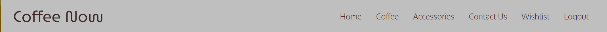

# Coffee Now - Portfolio Project 4 - Full Stack Toolkit

## Live site

<https://coffee-now-pp4.herokuapp.com/>

## Repository

<https://github.com/Kieran132/Coffee_Now>

## Contents

- Project Goals
- UXD - User Experience Design
- Existing Features
  - Home Page
  - Order
  - Accessories
  - Contact
  - Wishlist
  - Sign Up
  - Log In
  - Log Out
- Technologies Used
- Testing
- Deployment
- Credits

---

## Project Goals

Coffee Now is my fourth project as part of the Code Institute Full Stack Web Developer Course.

The idea behind this project was to combine basic CRUD (Create, Read, Update, Delete) with a functioning website that allows different levels of authorised user to be able to do certain tasks within the project. The technolgies used within this project are; HTML, CSS, Javascript, Python and Django. Within this project I wanted to create a modern, sleek designed, interactive platform that allows any user to view the products and be able to find contact information. In addition, allow authenticated users to add items to their wishlist. Going further, allowing admin the ability to create, read, update and delete products without the use of the admin panel.

---

## UXD - User Experience Design

When designing and creating this project it was important to keep the user experience at the forefront of everything. This was achieved by breaking the project down into 5 planes;

- The Strategy Plane
- The Scope Plane
- The Structure Plane
- The Skeleton Plane
- The Surface Plane

---

## Strategy Plane

In this deisgn phase, I defined my initial outcomes in product objectives and also the user needs. From the beginning I knew that the website I create needed to be clean looking, modern, easy to use, clear to use and visually appealing to the user.

<u> Prodject Objectives </u>

- Working an operational website
- The use of CRUD functionality
- Clean, modern and sleek design

<u> Users and User Needs </u>

- Coffee enthusiasts looking for new type of coffee/accessory
- People looking to gift a product to another person
- Simple and easy navigation
- Clear direction on how to use the website

---

## Scope Plane

Within the Scope Place, I defined the features that I think would be best suited to the project and the design.

<u> Features </u>

- Homepage
- Order page showing range of products
- Accessory page showing the range of products
- Contact page showing where we are via google maps and contact form
- Product detail page
- Wishlist page
- Different levels of authorisation accessibility

---

## Structure Plane

Here at the Structure Plane, this is where I outlined the design colours, fonts and the building blocks of the project

#### Colors

The contrast between the browns, cream and greys I thought added to the theme of coffee orientated website, but in addition to this added a modern twist.
Light Grey was used for navbar and footer to give a bold definitive look to top and bottom with the dark brown used as the font color to add contrast and make the font stand out.
The seasalt is used as an off white background color throughout the website.
The dark grey is used as color for the thematic break within the project.
The light brown is used throughout the project for the color of the font as its bright and eye catching but still readable.

<u> Fonts </u>

For all H1 tags I used MuseoModerno font. This gives a fun twist but still formal with more flowing nature of the font

Body of the porject Oxygen font was used. This font is clean and easy to read

<u> Key Models </u>

- User Autehntication

- Allauth creates user profile and determines the depths of use within the project

- Coffee

  - Shows coffee products to the user
  - Depending on authentication, the user can add items to the wishlist or if admin they can add, edit and delete products

- Accessories

  - Shows accessory products to the user
  - Depending on authentication, the user can add items to the wishlist or if admin they can add, edit and delete products

- Contact

- Shows user contact form which submits the form to the terminal

- Wishlist

  - Combines both order and accessories model for the authenticated user to see
  - These products can be deleted from the page by the user

---

## Skeleton Plane

#### Home Page

I knew how I wanted my home page to look. Welcome text at the top for an inviting feel then blocks of text telling the user what CoffeeNow is about, the ethos and where they get their coffee from. I wanted the layout to be simple and easy for the user and not too much text as to lose the interest of the user.

#### Coffee Page

The layout of the page I wanted contained into a 3 row formation. This I thought would allow the products to be easily visible and readable. Each card would uniform in shape with the other and the layout would identical also. For a responsiveness design the products will be stacked on top of one another depending on the screen size

#### Coffee Detail Page

This page I wanted a more indepth description and summary of the product in question. The image will be larger to the left of the screen with title, descriptions, price and button navigations on the right of the image. For a responsiveness design, the image will appear at the top of the screen with the description and buttons following below

#### Contact Page

For the contact page, I wanted to create a simple form that was easy to understand for the user and one which allowed the user to submit only the neccessary field - name, email address and message. In addition, I wanted to add google maps function so the user could physically see the location of CoffeeNow

#### Accessories Page

The accessory page I felt needed to be similar to that of the order page. Firstly because of the uniformity of the website throughout but also the way in which each of the products are easily visible and readable. The responsiveness is also the same as the orde page where they are in one coloum above eachother

#### Wishlist Page

Whenever the user added a product to their wishlist, I wanted again to stick to the row of 3 look to keep that uniformity. The responsiveness is also the same as the orde page where they are in one coloun above eachother

---

## Surface Plane

#### Navigation Bar

- Designed and visible throughout
- Fully responsive on all screen sizes
- Easy and clear navigation

#### Footer

- Designed and visible throughout
- Fully responsive on all screens
- Social media icons with links

#### Home Page

- Welcoming message
- Clear descriptuive text
- Relevant images corrisponding to the text

#### Coffee Page

- Visible images showing what the product is
- Readable text
- Clear navigation button

#### Order Detail Page

- Large image to left side of the page
- More in-depth description of the chosen product
- Clear navigations buttons

#### WishList Page

- Visible layout on what the user has added
- The ability to delete individual porducts

---

## Future Updates and Improvements

- Add the ability for user to purchase the items
- Search feature
- Sorting feature for each page
- Enable the user to build and tailored profile

---

## Technologies Used

- Python
  - asgiref==3.6.0
  - backports.zoneinfo;python_version<"3.9"
  - cloudinary==1.32.0
  - dj-database-url==0.5.0
  - dj3-cloudinary-storage==0.0.6
  - Django==3.2.18
  - django-allauth==0.54.0
  - django-summernote==0.8.20.0
  - gunicorn==20.1.0
  - oauthlib==3.2.2
  - Pillow==9.4.0
  - psycopg2==2.9.5
  - PyJWT==2.6.0
  - python3-openid==3.2.0
  - pytz==2023.3
  - requests-oauthlib==1.3.1
  - sqlparse==0.4.3
  - urllib3==1.26.15
- HTML
- CSS
- Bootstrap
- Javascript
- Google Fonts
- Font Awsome
- Git
- Github
- Gitpod
- Google Developer Tools
- Balsamiq
- SweetAlert

---

## Browsers Used to view website

- Chrome
- Firefox
- Safari

---

## Testing

Please click the link below to see the testing document

[Testing](/TESTING.md)

---

## Deployment

### Github Deployment

The website was delpoyed using GitHub. To do this I did the following;

1. When on the websites GitHub repository, click on the settings tab
2. Now on the settings page, on the left hand side of the page, click on the pages tab
3. Under the Source section, click on the drop down menu titled Branch and select main
4. The page is now published with a link available to use.

(<https://github.com/Kieran132/Coffee_Now>)

### Creating a Fork or Copying

To clone/fork/copy the repository you click on the fork tab which is situated next to unwatch tab in the top right corner of the page

### Clone

To create a clone you do the following;

1. Click on the code tab, left of the Gitpod tab
2. To the right of the repository name, click the clipboard icon
3. In the IED open GitBash
4. Change the working directory to the location you prefer
5. Add Git Clone with the copy of the repositroy name
6. Clone has been created

### Repositroy deployment via Heroku

- On the <https://dashboard.heroku.com/apps> page, click New and then select Create New App from the drop-down menu.
- When the next page loads insert the App name and Choose a region. The click Create app
- In the settings tab click on Reveal Config Vars and add the key Port and the value 8000. There were no credentials required for this app.
- Below this click Add buildpack and choose python and nodejs in that order.

#### Deployment of the app

- Click on the Deploy tab and select Github-Connect to Github.
- Enter the repository name and click Search.
- Choose the repository that holds the correct files and click Connect.
- A choice is offered between manual or automatic deployment whereby the app is updated when changes are pushed to GitHub.
- Once the deployment method has been chosen the app will be built and can be launched by clicking the Open app button at the top of the page.

---

## Credits

#### Products

- All the products on the order page came from Round Hill Roastary Website (<https://roundhillroastery.com/shop/product/isabel-1-anaerobic/>)
- All products on the accessory page came from Origin Coffee Website (<https://www.origincoffee.co.uk/products/kalita-filter-papers>)

#### Code

- Help with functionality and how to get the project working came from Code Institue walkthrough project, Boutigue Ado
- Code Institue Tutors helped iron out parts of the code where I was unsuccessful in doing so

#### Django Documentation

- Any issues involving django, I referenced their online documentation to guide me through step by step (<https://docs.djangoproject.com/en/4.2/>)

#### Bootstrap

- The styling format came from the Bootstrap library throughout the website. This is in the from of navigation bar, collapsed navigation bar, cards for all products, button designs and froms

(<https://getbootstrap.com/docs/5.3/getting-started/introduction/>)

#### SweetAlert

- This was a new framework I sourced in order to provide a more friendly user experience for pop up messages.

(<https://sweetalert.js.org/docs/>)
